# WeGui-ARGB · V0.4.0 beta

轻量级嵌入式 GUI 框架，面向多种 MCU / SoC 平台，同时提供轻量 PC 模拟器（SimLite，无 SDL 依赖，TCC 秒级编译）。

> 当前版本 **V0.4.0 beta**（版本宏定义见 `we_user_config.h` 的 `WE_GUI_VERSION`）。

## 特性

- 小内存占用的局部帧缓冲（PFB）渲染
- 脏矩形刷新策略（全屏 / 单包围盒 / 多脏矩形）
- 统一的 GUI tick / timer / 中央动画调度
- 全局聚焦 + 按键导航（方向键空间就近移动 / Tab 环序 / OK 双沿按压 / 容器下钻，触摸与按键共存，纯触摸工程可整体编译剔除）
- 图片格式：RGB565 / ARGB8565（无压缩与索引 QOI）+ A1/A2/A4/A8 透明位图（前景色上色，同一份取模反复换色复用）+ 索引QOI_MASK 压缩 A8 蒙版（alpha 推荐格式，行索引随机访问、流式解码零额外 RAM，48×48 图标约为裸 A8 的 21%~40%）
- 内置控件与完整 demo 工程；`tool/` 编号例程式资源流水线（字体/图片取模 → 外挂 bin 合并 → 烧录）
- 支持外部 Flash 图片与字体资源（模拟器直读 `merged_bin.bin`，与硬件"重烧"流程对应）
- 同时支持 STM32F103 / STM32F030 / 杰理 AD14N（AD142A4）硬件目标与 SimLite PC 模拟器目标（fenster 三平台窗口底座：Win32 GDI / macOS Cocoa / Linux X11）
- headless 基准哈希回归：67 项逐帧 CRC 金样（含 10 条交互轨迹脚本），一条命令全量校验

## 资源占用（实测）

| 目标 | ROM | RAM | 口径 |
|---|---|---|---|
| STM32F103（Cortex-M3，72 MHz） | **24.21 KB** | **6.10 KB** | dropdown 最小可交互应用（= 下方逐 demo 表第 19 号） |
| STM32F030（Cortex-M0，48 MHz，DMA 双缓冲） | **23.5 KB** | **6.06 KB** | 同口径（V0.3.0 全表 F030 实测，整体约比 F103 小 0.7 KB） |

- 280×240 RGB565，PFB 8 行（4.48 KB，仅整屏显存的 3.3%）；ROM 含 3.21 KB 字体资产与约 6.7 KB 端口/启动/C 库，GUI 本体（内核 + 控件）占用见下表逐 demo 分项
- 共享配置实测口径：聚焦/按键导航（`WE_CFG_ENABLE_KEY_INPUT=1`）等默认功能全开——纯触摸工程关掉裁剪宏还能再瘦
- 零 malloc、零浮点路径，Cortex-M0（无硬件除法、无 FPU）原生可用

### 各 demo 单独占用与效果图（STM32F103 / Cortex-M3 实测）

每个 demo 单独编译（`DEMO_ID` 选中该 demo，链接器剔除未引用部分）后的 Keil AC5 `.map` 实测（**indexQOI V3 当前代码全表重测**）。每个 demo = **该主控件 + `label`（标题/FPS）**，复合类额外含子控件；第 1 号 `label` 即"最小 GUI + 字体 + 端口 + 启动"的底座。

分项四列均为 ROM 占用（Code + RO-data + RW-data，单位 KB，四列相加 = 总 ROM）：

- **内核** — GUI 引擎本体（`we_gui_driver` / `we_render` / `we_font_text` / `dirty_driver` / `we_scroll`）；未引用的内核函数会被链接器剔除，所以逐 demo 不同——纯控件类 demo 约 7.3~9.7 KB，图片类 demo 链入索引 QOI / QOI_MASK 解码器后约 11 KB
- **控件** — 该 demo 链入的全部 `we_widget_*` 本体
- **资源** — 字体点阵与 demo 内嵌图片数组；其中约 3.21 KB 是各 demo 共有的 ASCII 字体资产
- **其他** — demo 代码 + LCD/输入/外挂存储端口 + 启动文件 + C 库，约 6.4~7.6 KB 基本恒定
- 总 RAM = RW-data + ZI-data，含 4.48 KB PFB 显存（各 demo 共有）

> 效果图为 SimLite 模拟器无头渲染第 120 帧导出（280×240，与硬件同一套渲染内核、逐像素一致）；
> 画面中的 FPS 数字是无头快进渲染的计数残影，不代表硬件帧率。

| 效果图 | DEMO_ID · demo | 总 ROM | 总 RAM | 内核 | 控件 | 资源 | 其他 | 备注 |
|---|---|---|---|---|---|---|---|---|
| 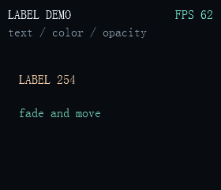 | 1 label | 18.00 | 5.88 | 7.63 | 0.55 | 3.21 | 6.61 | 基准底座：最小 GUI + 字体 + 端口 + 启动 |
| 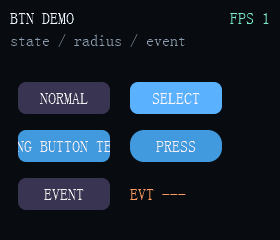 | 2 btn | 19.62 | 6.04 | 8.44 | 1.22 | 3.21 | 6.75 |  |
| 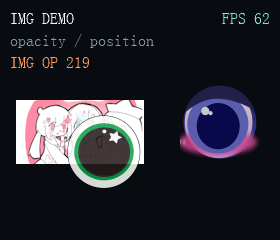 | 3 img | 50.00 | 5.94 | 11.02 | 0.64 | 31.78 | 6.55 | 内嵌图片资产（indexqoi V3 ×2 + argb8565 raw） |
| 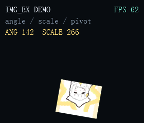 | 4 img_ex | 29.01 | 5.90 | 7.63 | 1.73 | 13.22 | 6.43 | 内嵌 RGB565 raw 图（img_ex 仅收 raw） |
| 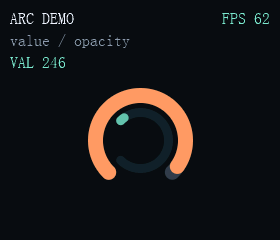 | 5 arc | 20.77 | 5.93 | 8.07 | 2.87 | 3.21 | 6.63 |  |
| 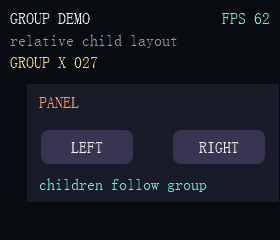 | 6 group | 21.18 | 6.05 | 9.11 | 1.94 | 3.21 | 6.91 | 含 btn/label 子控件 |
| 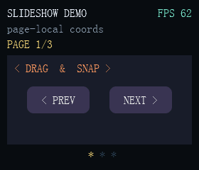 | 7 slideshow | 25.73 | 6.28 | 9.20 | 5.79 | 3.21 | 7.53 | group + 分页指示 |
| 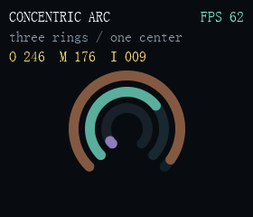 | 8 concentric_arc | 20.75 | 5.98 | 8.07 | 2.80 | 3.21 | 6.67 |  |
| 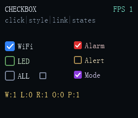 | 9 checkbox | 20.63 | 6.24 | 8.83 | 1.42 | 3.21 | 7.17 |  |
| 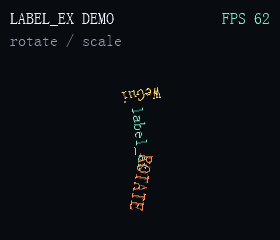 | 10 label_ex | 19.36 | 5.93 | 7.69 | 1.97 | 3.21 | 6.49 |  |
| 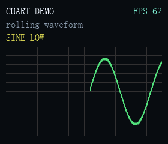 | 11 chart | 20.14 | 6.45 | 7.63 | 2.77 | 3.21 | 6.54 | RAM 偏高（波形环形缓冲） |
| 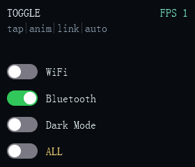 | 12 toggle | 20.09 | 6.20 | 8.52 | 1.36 | 3.21 | 7.00 |  |
| 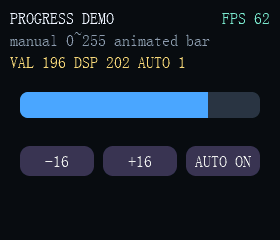 | 13 progress | 21.38 | 6.04 | 8.71 | 2.59 | 3.21 | 6.86 | 含 btn |
| 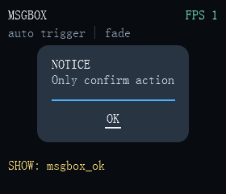 | 14 msgbox | 22.93 | 6.05 | 9.05 | 3.66 | 3.21 | 7.00 | 含 btn；顶层非模态弹窗 |
| 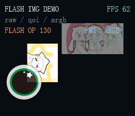 | 15 flash_img | 20.46 | 5.98 | 7.63 | 2.88 | 3.25 | 6.71 | 图片数据在外挂 SPI flash，片内仅地址表 |
| 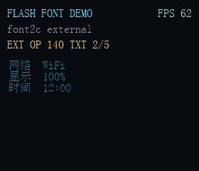 | 16 flash_font | 20.57 | 6.10 | 7.63 | 2.68 | 3.26 | 7.00 | 字形数据在外挂 SPI flash，片内仅索引与地址表 |
| 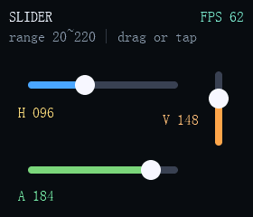 | 17 slider | 21.03 | 6.09 | 8.38 | 2.45 | 3.21 | 6.99 |  |
| 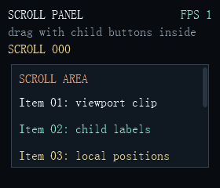 | 18 scroll_panel | 22.75 | 6.31 | 8.71 | 3.27 | 3.21 | 7.55 |  |
| 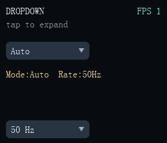 | 19 dropdown | 24.21 | 6.10 | 9.47 | 4.83 | 3.21 | 6.70 | 同上方汇总表 F103 行 |
| 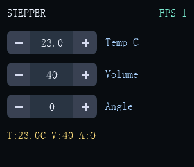 | 20 stepper | 20.79 | 6.14 | 8.51 | 2.46 | 3.21 | 6.60 |  |
| 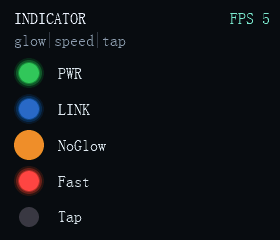 | 21 indicator | 20.36 | 6.23 | 8.62 | 1.61 | 3.21 | 6.92 |  |
| 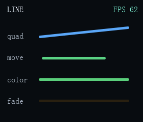 | 22 line | 20.96 | 6.38 | 9.06 | 1.77 | 3.21 | 6.92 |  |
| 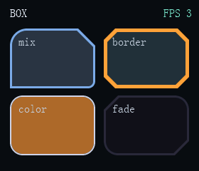 | 23 box | 21.32 | 6.06 | 8.15 | 3.12 | 3.21 | 6.84 | 动画默认编译期关闭（`WE_BOX_USE_ANIM`） |
| 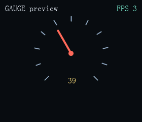 | 24 gauge | 20.89 | 6.02 | 9.08 | 2.21 | 3.21 | 6.40 |  |
| 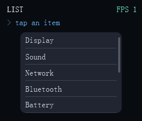 | 25 list | 21.56 | 5.91 | 9.10 | 2.81 | 3.21 | 6.43 |  |
| 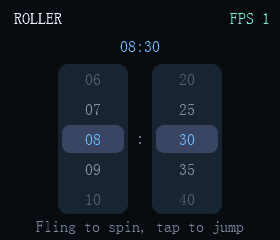 | 26 roller | 21.85 | 6.17 | 8.58 | 3.13 | 3.21 | 6.92 |  |
| 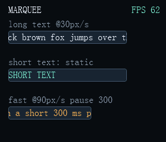 | 27 marquee | 22.68 | 6.16 | 8.29 | 4.43 | 3.21 | 6.75 |  |
| 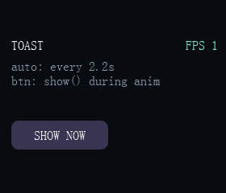 | 28 toast | 21.01 | 5.89 | 8.69 | 2.48 | 3.21 | 6.63 |  |
| 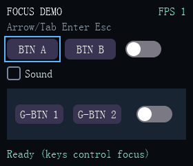 | 29 focus | 23.26 | 6.16 | 9.51 | 3.64 | 3.21 | 6.89 | btn/checkbox/toggle/indicator/group 组合 |
| 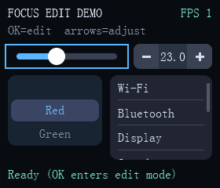 | 30 focus2 | 28.59 | 6.22 | 9.10 | 9.30 | 3.21 | 6.97 | slider/stepper/roller/list 组合 |
| 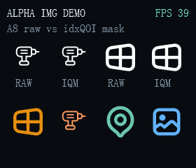 | 31 img_alpha | 28.76 | 6.18 | 11.02 | 0.64 | 10.44 | 6.66 | A8 raw 与索引QOI_MASK 压缩对比 |
| 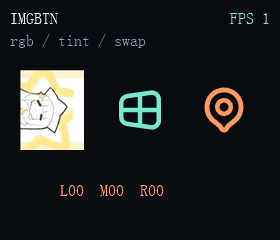 | 32 imgbtn | 35.77 | 5.97 | 10.79 | 1.10 | 17.12 | 6.75 | 全图片格式可作按钮皮肤 |
| 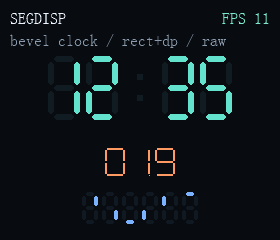 | 33 segdisp | 19.53 | 5.98 | 7.30 | 2.08 | 3.21 | 6.93 | 无字库外资产；控件本体极小 |

> 内核里没被引用的 API 不进固件：新增 `we_obj_set_size` 后全表逐行零变化，
> 同口径的 F103 dropdown 更是逐字节相同（Code/RO/RW/ZI 四项全等），
> 说明链接器把未引用的内核函数整体剔除了——按需付费，加 API 不涨底座。
>
> `img`/`img_ex`/`img_alpha`/`imgbtn` 的总 ROM 偏大源自**资源列**的 demo 内嵌图片资产，
> 与控件代码无关（控件列 0.6~1.7 KB）。`showcase`（仅模拟器、需 800×480）无法烧录到
> MCU，故不在此表；其余 1..33 均可单独烧录。F030 同口径整体约小 0.7 KB（少一份外挂
> flash 端口实现）。

## 当前控件状态

当前仓库已包含并维护以下主要控件：

- label
- btn
- img
- img_ex
- arc
- group
- slideshow
- checkbox
- label_ex
- chart
- toggle
- progress
- msgbox
- img_flash
- font_flash
- slider
- scroll_panel
- dropdown
- stepper
- indicator
- line
- box
- gauge
- list
- roller
- marquee
- toast
- imgbtn
- segdisp

其中：

- `toggle` 的轨道和滑块已统一复用公用解析式圆角矩形填充函数
- `checkbox` 的方框绘制已统一复用公用解析式圆角填充函数
- `chart` 的波形主体与柔边绘制思路参考自 Arm-2D，但实现已按 WeGui 的环形缓冲、脏矩形、PFB 裁剪与整数坐标体系重写
- `dropdown` 展开列表支持无级（像素级）拖拽滚动，滚动条按空闲时间自动淡出至常驻最低透明度
- `stepper` 数值用定点 int32 存储，按住可连续步进且不占用 timer 槽
- `indicator` 圆形状态灯通过中央动画引擎（`we_anim_t`，不占定时器槽位）做亮灭过渡，可选外发光晕
- `msgbox` 为水平居中的顶层弹窗（非模态，挂 LCD 顶层链保证置顶），采用透明度淡入/淡出 + 解析式圆角面板
- `line` 为抗锯齿线段（圆头/平头），端点几何、颜色、透明度三通道各占独立动画节点、可同时动画
- `box` 为矩形面板：四角可各自独立配置圆角/切角/直角，支持边框厚度与颜色；中央与直边整块快速填充，仅四角方块逐像素抗锯齿合成；颜色/透明度动画为编译期可选项（`WE_BOX_USE_ANIM`，默认关闭）
- `gauge` 为仪表盘（刻度/指针/中心帽全部复用现有抗锯齿原语）：指针差分标脏——数值变化只重绘新旧指针位形两块包围盒、静态刻度区零重绘；值→角度走 set_range 预除的 Q16 斜率，draw 内零三角函数、零乘除
- `list` 为数据驱动列表菜单（字符串数组由调用方持有，控件只存指针）：拖拽松手与快速轻扫都注入惯性，越界橡皮筋过冲后回弹，滚动条空闲自动渐隐至常驻低透明（dropdown 同款口径）；行按压/滚动/滚动条各自精细标脏
- `roller` 为滚轮选值器：慢速松手就近吸附，快速甩动惯性继承拖拽速度、滑过多行再减速吸附，轻点上/下可见行直达该行；滚动只标文本列带，文字测量走 y-bbox 常量化 + 行宽缓存（绘制内环零测量调用）
- `marquee` 为跑马灯标签："放得下静止、放不下循环滚动"自适应（两段绘制无缝接缝 + 可停留）；窗口化字形绘制对不可见字形只做游标快进（零位图取址、零像素扫描），滚动由单个中央动画节点推进
- `toast` 为非模态轻提示横幅（挂 LCD 顶层链，浮于一切之上且不拦截输入）：顶部滑入 → 停留 → 滑出；滑动每步把新旧包围盒 union 成单个矩形一次标脏，超宽文本尾部自动截断加省略号
- `img` 支持 RGB565 / ARGB8565 raw、两种索引 QOI、A1/A2/A4/A8 透明位图与索引QOI_MASK 压缩 A8 蒙版（`we_img_obj_set_color` 前景色上色，默认白色）；`dropdown` 展开列表 / 弹层软键盘走顶层 + 模态通道（命中与语义键直送模态对象）
- 所有带动画的控件（toggle/progress/indicator/msgbox/slideshow/scroll_panel/dropdown/line/gauge/list/roller/marquee/toast）统一走**中央动画引擎**，不占用定时器槽位、数量无上限、空闲自动摘链
- 容器透明度可向子控件级联传播（group/slideshow/scroll_panel）；裸 `group` 会把触摸事件转发给内部子控件，全透明 group 不拦截输入
- `imgbtn` 为图片按钮：与 `img` 共用渲染层格式分发（全部图片格式可作按钮皮肤），无按压态图时自动变暗（带透明通道压透明度、不透明图叠半透明黑），支持运行时换图与 OK 键双沿触发
- `segdisp` 为段码数码管：每位一个段码字节（bit0~6 = a~g、bit7 = dp，与 TM1650 类驱动段码表对齐），文本便捷层与段码直控双通道，45° 斜切段形（可选矩形）、逐位标脏；字宽/字高/间距/段厚在 init 全参数化（0 = 自动推导）

除稳定区外，仓库另设 **preview 孵化区**：实验控件位于 `Core/widgets_preview/`（demo 在
`Demo/preview/`，DEMO_ID 使用 100 起的独立编号段），四个目标均参与编译（链接器剔除未引用部分），
未细致优化、随时可能下架；毕业后才迁入 `Core/widgets/` 与稳定编号段（已毕业迁出的编号留空洞
不复用，如 117→33 segdisp、120→32 imgbtn）。当前含 `mask_group` 在内共 24 个实验控件，
完整清单见 `Demo/preview/preview_demos.h` 顶部的编号一览。

## 仓库结构

- `Core/` — GUI 内核、渲染与控件实现
- `Demo/` — 各控件 demo 与模板端口文件
- `STM32F103/` — STM32F103 硬件入口、Keil 工程与 LCD/输入/外挂 Flash 端口层
- `STM32F030/` — STM32F030 硬件入口、Keil 工程与 LCD/输入端口层
- `AD14N/` — 杰理 AD142A4（sh54 内核）硬件入口、CodeBlocks 工程 + 无头构建脚本、SPI1+DMA LCD 端口、单按键端口与裁剪版 SDK 子集
- `SimLite/` — 轻量 PC 模拟器：移植模板式入口、fenster 端口与配置、TCC/gcc 构建脚本、headless 基准哈希回归（`autotest.ps1` + `debug/` 开发者工具）
- `tool/` — 编号例程式资源流水线（字体/图片取模 → 外挂 bin 合并 → W25Qxx 烧录）

## 快速开始

### 1. SimLite（PC 模拟器）

无 SDL、无 CMake：把 TinyCC 解压到 `SimLite/tcc/`（全套约 2.5 MB）即可秒级全量编译；
已装 MinGW 时自动回退 gcc（带 `-g`，可配合 VS Code gdb 调试）。

正式版构建（demo 由 `SimLite/main_lite.c` 顶部的 `DEMO_ID` 宏决定，与硬件目标同一套用法）：

```powershell
powershell -NoProfile -ExecutionPolicy Bypass -File "SimLite/build_lite.ps1"
```

不改源码临时换 demo / 构建完直接运行：

```powershell
powershell -NoProfile -ExecutionPolicy Bypass -File "SimLite/build_lite.ps1" -Demo 25 -Run
```

开发者版 `wegui_lite_dev`（运行时选 demo：`wegui_lite_dev 25`，另有 `--list` / `--shot` / `--autotest`）：

```powershell
powershell -NoProfile -ExecutionPolicy Bypass -File "SimLite/build_lite.ps1" -Dev
```

macOS / Linux（clang+Cocoa / cc+libx11-dev）：`sh SimLite/build_lite.sh [--dev]`

### 2. STM32F103 / STM32F030 — Keil MDK-ARM AC5

命令行构建示例：

```powershell
UV4.exe -r "STM32F103/MDK-ARM/Project.uvprojx" -t "WeGui_ARGB"
UV4.exe -r "STM32F030/MDK-ARM/Project.uvprojx" -t "STM32F030"
```

说明：
- `UV4.exe` 的实际路径取决于你的本地 Keil 安装位置
- 构建日志：F103 在 `STM32F103/MDK-ARM/Objects/Project.build_log.htm`，F030 在 `STM32F030/MDK-ARM/STM32F030/STM32F030.build_log.htm`

当前代码状态下，F103 / F030 工程均已验证可编译通过：`0 Error(s), 0 Warning(s)`

### 3. AD14N（杰理 AD142A4）— CodeBlocks / pi32

需要杰理 pi32 工具链（随杰理版 CodeBlocks 安装，默认 `C:\JL\pi32`）。两种等效构建方式：

```powershell
# 无头构建（编译 + LTO 链接 + app.bin）；加 -Download 经 USB 烧录
powershell -NoProfile -ExecutionPolicy Bypass -File "AD14N/build_ad14n.ps1"

# CodeBlocks 命令行（会连带跑 post-build 的 download.bat，打包 wegui/update.ufw；
# 不接板时仅 USB 下载一步失败，不影响产物）
& "C:\Program Files\CodeBlocks\codeblocks.exe" /na /nd /ns --rebuild --target=Release AD14N\AD14N_wegui.cbp
```

说明：
- 工程文件 `AD14N/AD14N_wegui.cbp` 由 `AD14N/gen_cbp.ps1` 生成（glob 收集源文件），增删 `.c` 后重跑一次即可
- 产物在 `AD14N/sdk/app/post_build/sh54/`：`app.bin`（单 demo 约 30~37 KB / 512 KB flash）、`wegui/update.ufw`（升级固件包）
- 板级配置：480×320 ST7796S（SPI1 寄存器直操 + DMA，热路径入 RAM），PA0 单按键 = 短按 `NEXT` / 长按 `OK`，调试串口 PA9 @ 1 Mbps
- 限制：无触摸；demo 15/16 需外挂 flash（本片无外挂，画面为空占位）；113（拼音输入法，字库约 700 KB）超出 512 KB flash 无法装下

## Demo 选择

当前 simple demo 共 **33 个**，四个目标（SimLite / STM32F103 / STM32F030 / AD14N）编号已统一：`1..33` 完全一致；SimLite 额外用 `0 = showcase`（全控件汇总，仅模拟器，需把分辨率调到 800×480）。选择方式是**编译期宏**——改入口 `main` 顶部的 `#define DEMO_ID` 即可，只有选中的 demo 会被编译进去。

下表为统一后的 `DEMO_ID`：

| DEMO_ID | 内容 |
| --- | --- |
| 0  | showcase（全控件汇总，仅模拟器，需 800×480） |
| 1  | label |
| 2  | btn |
| 3  | img |
| 4  | img_ex |
| 5  | arc |
| 6  | group |
| 7  | slideshow |
| 8  | concentric arc |
| 9  | checkbox |
| 10 | label_ex |
| 11 | chart |
| 12 | toggle |
| 13 | progress |
| 14 | msgbox |
| 15 | flash img |
| 16 | flash font |
| 17 | slider |
| 18 | scroll_panel |
| 19 | dropdown |
| 20 | stepper |
| 21 | indicator |
| 22 | line |
| 23 | box |
| 24 | gauge |
| 25 | list |
| 26 | roller |
| 27 | marquee |
| 28 | toast |
| 29 | focus（聚焦/按键导航） |
| 30 | focus2（聚焦编辑态：方向键调值） |
| 31 | img_alpha（A8 raw 与索引QOI_MASK 压缩透明位图） |
| 32 | imgbtn（图片按钮） |
| 33 | segdisp（数码管） |

> `0`（showcase）仅 SimLite 提供；硬件目标无此项。未列编号各目标统一回退到 `label`。`29/30` 依赖 `WE_CFG_ENABLE_KEY_INPUT=1`（共享配置默认开启；关闭时这两个 demo 编译为提示桩）。模拟器按键映射：方向键 / Tab / Shift+Tab / Enter / 空格 / Esc / 退格。AD14N 单按键映射：短按 `NEXT`（焦点环下一个）/ 长按 `OK`（触发/下钻/编辑态），可聚焦类 demo 单键即可完整操作。

### 修改方法
改对应入口 `main` 顶部的 `#define DEMO_ID` 数字即可：`SimLite/main_lite.c`、`STM32F103/main.c`、`STM32F030/main.c`、`AD14N/main.c`（在 `app` 函数内）。硬件目标改完需重新编译 / 烧录；SimLite 也可用 `build_lite.ps1 -Demo N` 免改源码，或直接用开发者版 `wegui_lite_dev N` 运行时切换。

## 构建与验证

推荐的最小验证方式：

- **SimLite**：编译并运行 `wegui_lite`（或 `wegui_lite_dev <id>`），检查选定 demo 是否正常绘制与动画
- **STM32**：编译 Keil 工程并在板上运行选定 demo
- **AD14N**：`AD14N/build_ad14n.ps1 -Download` 编译并经 USB 烧录，在板上运行选定 demo

回归验证（headless 基准哈希，无需人工看屏）：

```powershell
powershell -NoProfile -ExecutionPolicy Bypass -File "SimLite/autotest.ps1"
```

只构建一次开发者版 exe（运行时选 demo，无需逐个重编译），对 1..33 与 preview
101..126（跳过毕业空洞 117/120）逐 demo 跑 180 帧（headless 不开窗、固定 16ms 步进），
对每帧屏幕缓冲做链式 FNV-1a 哈希并与 `SimLite/autotest/golden.txt` 比对（67 项，
全量约 80 秒）；`SimLite/autotest/scripts/*.evt` 存在时额外注入触摸/按键轨迹回放，
把拖拽惯性、焦点导航、弹层开合锁到逐帧精确。改动导致 FAIL 时先确认是回归还是
有意变更，有意变更用 `-Update` 重录基准（合并写回，只覆盖本次跑过的条目）。

## 资源与工具

`tool/` 为**编号例程式流水线**，每个阶段自带例程输入/输出（例程输出就是 demo 资产），双击对应 `.bat` 即可复现，使用说明见各目录的编号 `.txt`：

- `tool/0.tool/` — 底层转换器（font2c / img2bin_raw / img2bin_indexqoi / bin2c）
- `tool/1.font2c/` — 字体取模（向导生成配置 + 一键构建；内置字体出 `.c/.h`，外挂字体出索引 + 字形 `.bin`）
- `tool/2.img2c/` — 图片取模（按 像素格式 × 压缩 × 去向 分桶：`*_2c` 合并为内置数组，`*_2bin` 出散 bin；alpha 蒙版默认推荐索引QOI_MASK 压缩取模，A8 raw 桶保留）
- `tool/3.bin2c/` — 外挂资源合并（字体 + 图片 bin → `merged_bin.bin` + 地址表 `.c/.h`；另出仅供烧录工程的嵌数据版——体积大不入库，烧录前跑一次 `build_bin.bat` 再生）
- `tool/4.STM32F103_ex_flash_download/` — W25Qxx 烧录工程（经调试器用自制 FLM 算法写入外挂 Flash）
- `tool/0.1.2.3.update_all.bat` — 一键串联 1→2→3

外挂资产变更后：硬件需重烧 W25Qxx；模拟器直读 exe 旁的 `merged_bin.bin`（构建自动拷贝），重跑 `3.bin2c` 后重启即可，无需重新编译。

## 许可证

本项目使用 Apache License 2.0，详见根目录 [LICENSE](LICENSE)。
